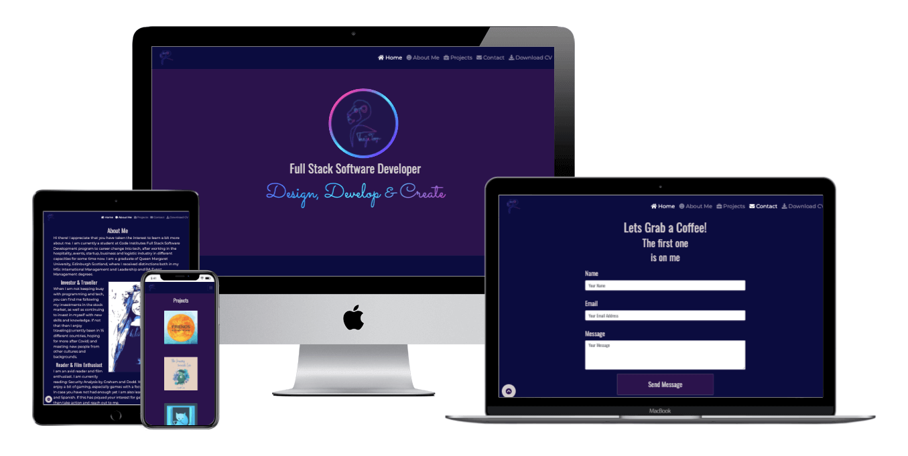
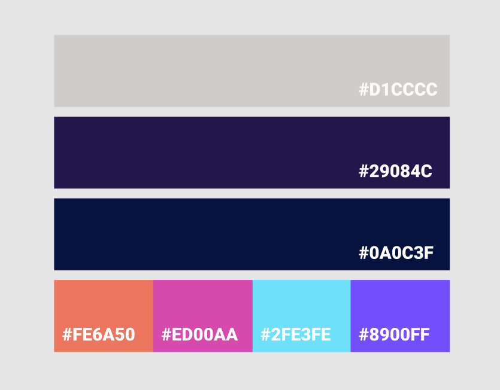

# **Milestone 1: Portfolio Website**

### **Project - User-Centric Frontend Development - Code Institute.**

This is a portfolio website to showcase the developers projects as well as giving an online presence for further use in the future. 
To have a platform where recruiters, developers and others can find them to get in touch to network, collaborate and offer opportunities. 
Also for them/the user to see a sample of the skillset and potential of the developer. 

A deployed link to the website can be found **[here](https://vtwin90.github.io/Milestone-1-Portfolio/)**.



## **Contents**

***

- [**User Experience (UX)**](<#user-experience-(ux)>)
  - [Project Goals](<#project-goals>)
  - [Importance and Feasibility chart](<#importance-and-feasibility-chart>)
  - [User Stories](<#user-stories>)
  - [Website Structure](<#website-structure>)
  - [Design Choices from UXD](<#design-choices-from-uxd>)
    - [Color Scheme](<#color-scheme>)
    - [Images](<#images>)
    - [Typography](<#typography>)
  - [Wireframes](<#wireframes>)
  - [Design Changes](<#design-changes>)

- [**Features**](<#features>)
  - [Existing Features](<#existing-features>)
  - [Features left to implement](<#features-left-to-implement>)

- [**Technologies**](<#technologies>)

- [**Testing**](<#testing>)

- [**Deployment**](<#deployment>)

- [**Credits**](<#credits>)

## **User Experience** (UX)
***

### **Project Goals**

The idea is to create a static front-end only website consisting of a single used page with at least 3 sections to advertise and showcase an up-and coming developer to recruiters, 
other developers/graphic designers and others, to get hired for opportunities, collaborations and networking. 
The basis for this idea is that it will be something to use in the future whilst developing knowledge, skills and other projects to portray this development and growth. 

### **Importance and Feasibility chart**
**Opportunity/Problem** | **Importance** | **Viability/Feasibility**
| :--- | ---: | :---:
A. Creation of online presence  | 5 | 5
B. Showcase developer and projects | 4 | 4
C. Promote Developer to recruiters, potential collaborators and other interested parties.  | 5 | 5
D. Get offers, opportunities for collaboration and networking.  | 4 | 4
E. Creation of contact form and response. | 3 | 3

#### [Back to top](<#contents>)

### **User stories**

#### **First Time Visitor Goals**

* As a **first time user** I want to be able to navigate through the whole site smoothly.
* As a **first time user** I want to understand the purpose of the site upon loading it.
* As a **first time user** I want to be able to easily view information about the developer on any screen size.
* As a **first time user** I want to easily be able to contact the developer for more information.
* As a **first time user** I want to be able to view examples of the developers portfolio projects.
* As a **first time user** I want to view developers skills and experience.
* As a **first time user** I want to be able to access the developers external social accounts.
* As a **first time user** I want to be able to get a downloadable CV of the site owner to easily share with others. 

#### **Site Owner Goals**

* As a **site owner** I want the landing page (index.html) to clearly provide all information needed about the site's purpose and be «eye catching» and interesting in the first seconds.
* As a **site owner** I want any user to receive the correct information for the viewport they are currently on.
* As a **site owner** I want users to be able to contact the site owner easily for hire opportunities, collaborations and networking.
* As a **site owner** I want an organized, intuitive navigation system.
* As a **site owner** I want users to see projects that showcase skills and growth.

#### [Back to top](<#contents>)

### **What is needed now and in the future?**

* The developer wants an aesthetically pleasing and professional website to reinforce their online presence and give a concise and a «pitch»/UPS of their skills and potential for growth and development. 
To enhance their desirability to be hired for opportunities, collaborations and networking. 
* There will be a landing page/home page to grab attention, while an about page to further tell and showcase the developer. This includes current sets of skills, and further skills being developed as well as interests to give it a personal flair. As well as establishing a bit of trustworthiness, Also contact information and form to easily reach the site owner.
* The owner could have their needs and more fulfilled by using a mobile first approach to a fully responsive website which would allow for easy navigation, use and no diminished experiences on all viewport sizes. 
* Clear simplistically designed pages and sections to draw attention to all the features offered (Home,About, Projects, Contact, Download CV, Navbar, Footer) which allows new users to become familiarized with the environment and can encourage them to contact the developer.
* Other features further down the line will allow the website to provide a more complete user experience by incorporating real projects, some other coding languages and update of skills. 
Possibly testimonials/references of the user to enhance more credibility and trust. These will all help with user satisfaction, retention and familiarisation with the developer and the portfolio website.

#### [Back to top](<#contents>)

### **Website Structure**

This website will use a single page structure, due to its simplicity and flow. Also since the content information is not going to be as massive as for instance an e-commerce site, a single page application/website can be used here. 
In the future if more advanced features will be included and more information will be put in, the developer can re-evaluate the need for more pages, or continuing using a single page application/website. 

However, to give the user more options and flexibility there will not only be a scrolling option, but also the user will have the option to click on the navigation bar to easily navigate through the different sections and back again to the main page(index.html). 
Upon loading the page the user will be directed to the home page (index.html) where they will get an introduction to the portfolio/website owner. 
The website will include a central navigation system to provide links to a minimum of 3 sections and providing information to the section title. 
There will be a subtle but noticeable indicator as to the current section the user is browsing. Responsive design will be added to the nav bar, and on small/mobile devices it will condense into a «hamburger» icon that will have a toggle to view the nav menu and its associated links. 
This will save screen space and keep to conventions users are expecting. 

#### [Back to top](<#contents>)

### **Design Choices from UXD**
***

The style is based on a minimalistic, readable, contrasting design for easy flow and navigation, as well as maintaining a consistency to allow the user to easily familiarise themselves with the site efficiently and intuitively. 
Based on this being a personal portfolio for the developer, the main inspiration and decisions will come from the developers research and own personal design.

The theme is a dark mode website, with a CSS animated circle with different colors(this animation is inspired by the northern lights, which gives an association of the owner's birthplace: Norway). 

The site will have an official logo in the top left corner of the header, as this is the first spot most users look at when loading a website. 
Clicking the logo will return the user to the homepage (index.html). When hovering over the links on the navbar there will be a subtle visual cue to show the user where they are, and show their current location on the site.  

#### [Back to top](<#contents>)

### **Color Scheme**

The general color scheme is different shades of purple, blue and offwhite color. With some gradient colors consistent of purple, blue, orange and pink. These colors will create a consistent style for the website and thus the brand.



### **Images**

The images is consistent of: 
1. Logo, which has been drafted from a picture from Bing images. Then configured in Figma, by drawing it by pencil and adding a signature and colors.
2. Portrait, which is a private image from the site owner. Configured by using Clip2Comic and Figma.
3. Projects, private owned images from the site owner.

### **Typography**

To keep a consistent, professional and modern style, and for easy readability, the fonts used are Oswald(for headings), Montserrat (the general text), and Sacramento for the slogan. These are taken from Google Fonts library. 

#### [Back to top](<#contents>)

### **Wireframes**

|Sketches|Wireframes & Designs|                        
|:-----:|:----:|
|[Sketches](assets/wireframes&designs/sketches.pdf)| [Wireframes & Designs](assets/wireframes&designs/wireframes&designs.pdf)


### **Design changes**
**Logo:** 
* Changed colors to get it more visible after feedback from mentor, family and friends. 

**Font:**
* Changed fonts from Roboto, and Roboto Bold to Oswald, Montserrat and Sacramento.

**About Me:**
* Changed layout to include a portrait image.

**Projects:**
* Changed number of showcased projects from 6 to 3 after conversation with mentor.

**Collapsed Nav:**
The Hamburger Nav menu got changed to a simpler design (Bootstrap), due to the complexity of the layout without using JS.

#### [Back to top](<#contents>)

## **Features**
***

### **Existing Features**
Smooth scrolling for better UX, with hover function that lights up in the nav when moving sections.

Included in the **header** is:

* **Navigation Bar:** Fully responsive navbar will expand outside of smaller devices and overall provides a user friendly and intuitive browsing experience.

Included in the **footer** is:

* **Social media links:** Which will take you to the various social media connections: GitHub, Instagram, LinkedIn. Which will open in a new tab to maintain user retention.

Included in the **Home/landing** section is:

* **Logo, Developers name, Slogan:** A brief introduction to the owner and slogan. 
* **Animated Circle Element:** To give a focus point that captures your attention immediately at the site. 

Included in the **About Me** section is:

* **Introduction to Developer:** A introduction about the owner, with background information and education, as well as interests. An elevator pitch.  
* **Skills bars:**  Bar to illustrate the developers current skills(HTML,CSS, Bootstrap etc.), learning and want to learn. 

Included in the **Projects** section is:

* **Projects Containers:** Provides information and image of projects, with a hover animation. With clickable links.

Included in the **Contact** section is:

* **Contact Form:** Can be filled out with email and message query (with validation, “@” and “.”) and submitted to contact the owner. Currently due to no JavaScript the form cannot store or send data.

* **Modal:** A modal that lets the user know they have been successful in sending the message.

Included in the **DownloadCV** link is:

* **Download CV text and Icon:** A icon for the user to download the CV of the developer on a new page. 

Included in the **404.html** page is:

* A message telling the user they have accessed a page which does not exist.
* A button which is linked to index.html that prompts them to return to the site.

### **Features Left to Implement**

* To fill in the project section with real-life projects.
* To implement the email function to deliver the messages from the user to the developer. As well as letting the user verify their email.
* To update skills when learning new program languages. 
* Possibly testimonials/references of the user to enhance more credibility and trust. 
* Add a view all projects button that takes the user to a new page with more projects.

#### [Back to top](<#contents>)

## **Technologies**
***

### **Languages**

* [HTML5](https://en.wikipedia.org/wiki/HTML5 "HTML5") - provides the content and structure for the website.
* [CSS3](https://en.wikipedia.org/wiki/Cascading_Style_Sheets "CSS3") - provides the styling.

### **Frameworks, Libraries & Programs**

* [Bootstrap](https://getbootstrap.com/ "Bootstrap") - used to create the layout of the project.
* [Figma](https://www.figma.com/ "Figma") - used to create the projects wireframes, designs and logo.
* [Gitpod](https://www.gitpod.io/ "Gitpod") - used to develop the website.
* [GitHub](https://github.com/ "GitHub") - used to host the project.
* [Git](https://git-scm.com/) -used for version control.
* [Git Pages](https://pages.github.com/) - used to deploy the live site. 
* [Trello ](https://trello.com/ "Trello ") - used for time and project management.
* [Ilovepdf](https://www.ilovepdf.com/compress_pdf "Ilovepdf") - used for compressing pdf files.
* [Iloveimg](https://www.iloveimg.com/) - used to resize images.
* [TinyJPG](https://tinyjpg.com/) - used to reduce image file sizes. 
* [Google Fonts](https://fonts.google.com/) - used for typography.
* [Font Awesome](https://fontawesome.com/) - used for icons.
* [FavIcon](https://favicon.io/) -used for compressing logo into favIcons.
* [Clip2Comic](https://apps.apple.com/us/app/clip2comic-caricature-maker/id876328355) - used to change design on portrait image.  
* [Google Chrome Developer Tools](https://developers.google.com/web/tools/chrome-devtools) -used to inspect page elements, test different CSS styles, debug issues and responsiveness.
* [GoogleDrive Document](https://drive.google.com/drive) - used for writing up content for README.
* [Responsive Design Checker](https:/www.responsivedesignchecker.com/) -used to check responsiveness.
* [Techsini](http://techsini.com/multi-mockup/index.php) -used to create the Mock up image in this README.
* [Markdown-Cheatsheet](https://github.com/tchapi/markdown-cheatsheet/blob/master/README.md "Markdown-Cheatsheet") - used to find the right format for markdown.

## **Testing**
***
Testing results can be found **[here](TESTING.md)**.

HTML Code must pass through the **[W3C HTML Validator](https://validator.w3.org/ "W3C HTML Validator")**.

CSS Code must pass through the **[W3C CSS Validator](https://jigsaw.w3.org/css-validator/ "W3C CSS Validator")**.

#### [Back to top](<#contents>)

## **Deployment**
***

### Project Creation
Navigate to the **[template](https://github.com/Code-Institute-Org/gitpod-full-template)** and click 'Use this template'. Put in Repository name (Milestone-1-Portfolio) and check the Include all branches checkbox. Then navigate to the new **[repository](https://github.com/VTwin90/Milestone-1-Portfolio)**.

The following commands were used for version control throughout the project:
+ ```git status``` (checks which files have been modified or added, and ready to be committed)
+ ```git add . ``` or ```git add <filename>``` (add all changed files, or specific files within the project directory to be committed)
+ ```git commit -m "[TYPE] Reason"``` (commit changes to the local repository)
+ ```git push``` (push all committed changes to the GitHub repository)

### **Deployment to Github pages**

1. Push project to GitHub. Navigate and log into the GitHub site.
2. Go to repositories and select the one associated to this project: **[Milestone 1 Portfolio](https://github.com/VTwin90/Milestone-1-Portfolio)**.
3. On the main repository, click "Settings" and scroll to "Github Pages".
4. Under "Source" select "Master Branch" and click "Save".
5. Click on the link to go to the live deployed page.

The live link for the site is here: **[https://vtwin90.github.io/Milestone-1-Portfolio/](https://vtwin90.github.io/Milestone-1-Portfolio/)**

### **Create a local clone**

1. Open GitHub and navigate to repository **[here](https://github.com/VTwin90/Milestone-1-Portfolio)**.
2. Click the Code drop down menu. 
3. Options: 
* Download the ZIP file, unpack locally and open with IDE.  
* Copy git URL from HTTPS dialogue box. 
4. Open your chosen IDE and open terminal in a directory. 
5. Use ```git clone``` command with the copied git URL after.
6. Clone of the project is created locally on your machine.  

### **Fork Project**
1. Navigate to the GitHub Repository you want to **[fork](https://github.com/VTwin90/Milestone-1-Portfolio)**.
2. On the top right of the page under the header, click the fork button.
3. Creates a duplicate of the full project in your GitHub Repository.

#### [Back to top](<#contents>)

## **Credits**
***

### **Code**

Animated Circle Element adapted from:
* https://codepen.io/Olwiba/pen/XRVrZQ 

Gradient Slogan Phrase Text: 
* https://cssgradient.io/blog/css-gradient-text/

Project Showcase adapted from: 
* https://bbbootstrap.com/snippets/bootstrap-image-hover-effects-64168738

Social links design adapted from: 
* https://github.com/nemixu/Milestone1

JavaScript Modal: 
* https://codepen.io/dasan/pen/vqaLPe

Progress Bar: CI Rosie Resume 
* https://github.com/Code-Institute-Solutions/resume-miniproject-bootstrap4

Bootstrap assistance: 
* https://www.w3schools.com/bootstrap4/default.asp
* https://getbootstrap.com/docs/4.5/getting-started/introduction/
* https://css-tricks.com/snippets/jquery/smooth-scrolling/

General:
* https://www.w3schools.com
* https://css-tricks.com
* https://getbootstrap.com/

### **Media & Content**

Logo Inspiration:
* https://no.pinterest.com/pin/728105464739579361/

**All other images and text content are owned by the site owner.**

### **Acknowledgments**

I would like thank my mentor **[Maranatha Ilesanmi](https://github.com/mbilesanmi)** for all help throughout our project calls.

Thanks to fellow CI student **[John Traas](https://github.com/Jays-T)** for assisting with figuring out my Nav issue.

Thanks to graduate CI student **[Daisy McGirr](https://github.com/Daisy-McG)** for letting me use her test template and structure for making my own testing document.

Thanks to the **CI Slack Community** for feedback, motivation and assitance. 

Also a thank you to my family and friends who have helped me test various different versions of the website throughout the development process, as well as giving feedback on the layout and design. 

**This project is for educational use only and was created for the Code Institute Module of User Centric Front End Development.**

**Created by Vanja Torp 2021**

#### [Back to top](<#contents>)


