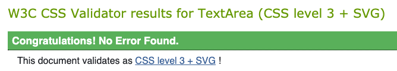

# Test Cases and Execution Report

Full downloadable excel document can be found [here](assets/images/testResults/testResults.xlsx).

Please note these results are a .xlsx file and will require excel, google docs or a compatible program to open the file.

## User Story Testing

### User Story:
> As a **first time user** I want to be able to navigate through the whole site smoothly.

Tests Covering story:
* TC06
* TC07
* TC08
* TCO9

### User Story:
> As a **first time user** I want to understand the purpose of the site upon loading it.

Tests Covering story:
* TC011

### User Story:
> As a **first time user** I want to be able to easily view information about the developer on any screen size.

Tests Covering story:
* TC003
* TC004
* TC005

### User Story:
> As a **first time user** I want to easily be able to contact the developer for more information.

Tests Covering story:
* TC06
* TC09

### User Story:
>  As a **first time user** I want to be able to view examples of the developers portfolio projects.

Tests Covering story:
* TC06
* TC08

### User Story:
> As a **first time user** I want to view developers skills and experience.

Tests Covering story:
* TC06
* TC07

### User Story:
> As a **first time user** I want to be able to access the developers external social accounts.

Tests Covering story:
* TC06

### User Story:
> As a **first time user** I want to be able to get a downloadable CV of the site owner to easily share with others. 

Tests Covering story:
* TC06

### User Story:
> As a **site owner** I want the landing page (index.html) to clearly provide all information needed about the site's purpose and be «eye catching» and interesting in the first seconds.

Tests Covering story:
* TC011

### User Story:
> As a **site owner** I want any user to receive the correct information for the viewport they are currently on.

Tests Covering story:
* TC07
* TC08
* TC09
* TC011

### User Story:
> As a **site owner** I want users to be able to contact the site owner easily for hire opportunities, collaborations and networking.

Tests Covering story:
* TC06
* TC09

### User Story:
> As a **site owner** I want an organized, intuitive navigation system.

Tests Covering story:
* TC06

### User Story:
> As a **site owner** I want users to see projects that showcase skills and growth.

Tests Covering story:
* TC08

# Issues and Resolutions

## Navigation Scroll-spy:

**Issue:**
The sizing was not consistent, so instead of setting individual margins and paddings on each ID I added the same class to each of them. For instance in #aboutme, #projects and #contact it was padding: 6% 5% 6% 5%; in #aboutme and #projects margin: 5% 0;  and in #contact margin: 0;

**Resolution:**
* Add a class of:  mt-5 and mb-5 to container-fluid elements
* Add a class of container-padding to each container fluid
* Set your padding to: 5% 5% 5% 5%;
* Remove the padding and margins from the individual id rules in css.

## Responsiveness:

**Issue:**
Had issues with the site not being fully responsive since I had target specific platforms. 

**Resolution:**
* Add new media quieres/screens: @media (min-width: 640px), @media (min-width:960px), @media (min-width:1100px), 
@media only screen and (min-width: 100px), @media only screen and (min-width: 768px), @media only screen and (min-width: 992px), 
and @media only screen and (min-width: 1500px).

## Main Logo:

**Issue:**
The Hero image/logo and circle animation jumped to the header. 

**Resolution:**
Fixed this by removing the top property on css style for both outer and inner circle class, and adding media quieres/screens.

## Slogan: 

**Issue:**
Slogan overflow logo.

**Resolution:**
Add margin-top: 300px, and changed px in media quieres to make it look good on different sizes/platforms.

## Images:

**Issue:**
The Images was not responsive and project hover animation was owerflowing.

**Resolution:**
Add: img-fluid img-responsive and image rounded mx-auto d-block classes. And specify different .image height and width, .image:after height and width in media quieres/screens.

# Lighthouse Report Mobile & Desktop

# Validator Results

### HTML

### CSS 
